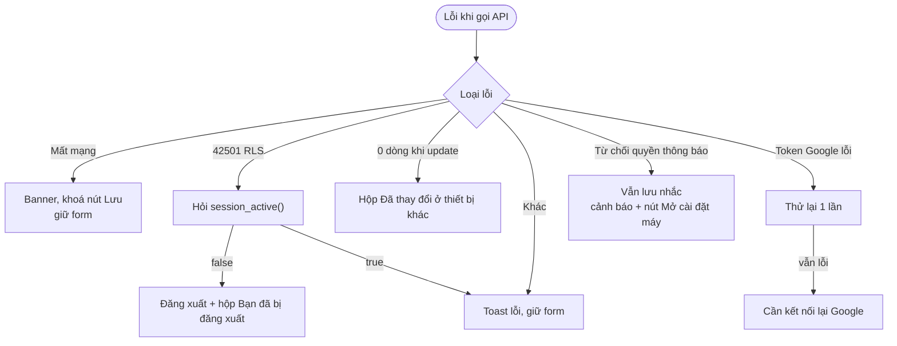

# Xử lý lỗi

Thuộc: [Kiến trúc](index.md).

[Spec tổng §5](../index.md#5-xử-lý-lỗi-chung).

```mermaid
flowchart TD
  Err(["Lỗi khi gọi API"]) --> Kind{"Loại lỗi"}
  Kind -->|"Mất mạng"| Net["Banner, khoá nút Lưu<br/>giữ form"]
  Kind -->|"42501 RLS"| Rls["Hỏi session_active()"]
  Rls -->|false| Kick["Đăng xuất + hộp Bạn đã bị đăng xuất"]
  Rls -->|true| Toast["Toast lỗi, giữ form"]
  Kind -->|"0 dòng khi update"| Conf["Hộp Đã thay đổi ở thiết bị khác"]
  Kind -->|"Token Google lỗi"| Retry["Thử lại 1 lần"] -->|"vẫn lỗi"| Reconnect["Cần kết nối lại Google"]
  Kind -->|"Từ chối quyền thông báo"| Perm["Vẫn lưu nhắc<br/>cảnh báo + nút Mở cài đặt máy"]
  Kind -->|"Khác"| Toast
```
