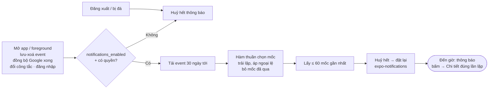

# Nhắc nhở

Thuộc: [Kiến trúc](index.md).

**(chưa code)** — spec: [S2 F3](../sprint-2/F3-reminders.md). Thông báo đặt trên từng máy từ dữ liệu DB; không push từ server.

```mermaid
flowchart LR
  Trigger["Mở app / foreground<br/>lưu-xoá event<br/>đồng bộ Google xong<br/>đổi công tắc · đăng nhập"] --> Enabled{"notifications_enabled<br/>+ có quyền?"}
  Enabled -->|Không| Cancel["Huỷ hết thông báo"]
  Enabled -->|Có| Load["Tải event 30 ngày tới"]
  Load --> Pick["Hàm thuần chọn mốc<br/>trải lặp, áp ngoại lệ<br/>bỏ mốc đã qua"]
  Pick --> Limit["Lấy ≤ 60 mốc gần nhất"]
  Limit --> Reset["Huỷ hết → đặt lại<br/>expo-notifications"]
  Reset --> Fire(["Đến giờ: thông báo<br/>bấm → Chi tiết đúng lần lặp"])
  Logout["Đăng xuất / bị đá"] --> Cancel
```
