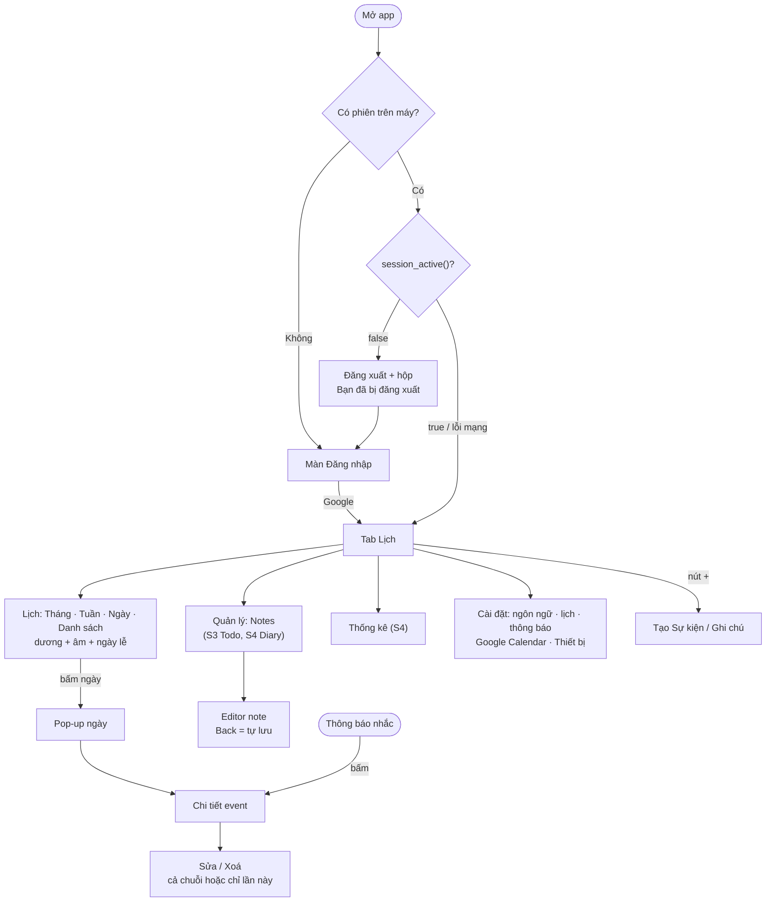

# Luồng user

Thuộc: [Kiến trúc](index.md).

```mermaid
flowchart TD
  Open(["Mở app"]) --> Local{"Có phiên trên máy?"}
  Local -->|Không| Login["Màn Đăng nhập"]
  Local -->|Có| Active{"session_active()?"}
  Active -->|false| Kicked["Đăng xuất + hộp<br/>Bạn đã bị đăng xuất"] --> Login
  Active -->|"true / lỗi mạng"| Tabs["Tab Lịch"]
  Login -->|"Google"| Tabs

  Tabs --> Cal["Lịch: Tháng · Tuần · Ngày · Danh sách<br/>dương + âm + ngày lễ"]
  Tabs --> Manage["Quản lý: Notes<br/>(S3 Todo, S4 Diary)"]
  Tabs --> Stats["Thống kê (S4)"]
  Tabs --> Settings["Cài đặt: ngôn ngữ · lịch · thông báo<br/>Google Calendar · Thiết bị"]

  Cal -->|"bấm ngày"| DayPop["Pop-up ngày"] --> Detail["Chi tiết event"] --> Edit["Sửa / Xoá<br/>cả chuỗi hoặc chỉ lần này"]
  Tabs -->|"nút +"| Create["Tạo Sự kiện / Ghi chú"]
  Manage --> Editor["Editor note<br/>Back = tự lưu"]
  Push(["Thông báo nhắc"]) -->|bấm| Detail
```
