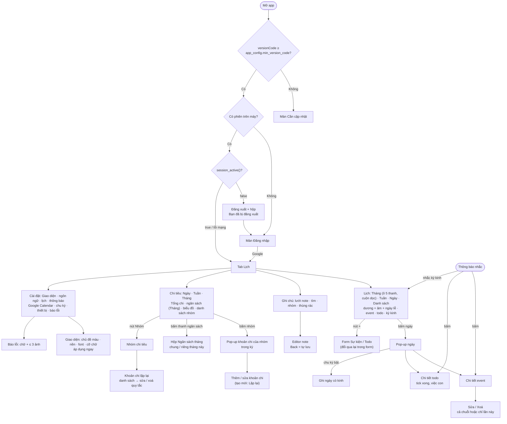

# Luồng user

Thuộc: [Kiến trúc](index.md).

Mọi màn: mất mạng → banner "Không có kết nối mạng." ở đầu, khoá thao tác ghi ([errors.md](errors.md)).

```mermaid
flowchart TD
  Open(["Mở app"]) --> Ver{"versionCode ≥<br/>app_config.min_version_code?"}
  Ver -->|Không| Update["Màn Cần cập nhật"]
  Ver -->|Có| Local{"Có phiên trên máy?"}
  Local -->|Không| Login["Màn Đăng nhập"]
  Local -->|Có| Active{"session_active()?"}
  Active -->|false| Kicked["Đăng xuất + hộp<br/>Bạn đã bị đăng xuất"] --> Login
  Active -->|"true / lỗi mạng"| Tabs["Tab Lịch"]
  Login -->|"Google"| Tabs

  Tabs --> Cal["Lịch: Tháng (ô 5 thanh, cuộn dọc) · Tuần · Ngày · Danh sách<br/>dương + âm + ngày lễ · event · todo · kỳ kinh"]
  Tabs --> Notes["Ghi chú: lưới note · tìm · nhóm · thùng rác"]
  Tabs --> Exp["Chi tiêu: Ngày · Tuần · Tháng<br/>Tổng chi · ngân sách (Tháng) · biểu đồ · danh sách nhóm"]
  Tabs --> Settings["Cài đặt: Giao diện · ngôn ngữ · lịch · thông báo<br/>Google Calendar · chu kỳ · thiết bị · báo lỗi"]

  Cal -->|"bấm ngày"| DayPop["Pop-up ngày"]
  DayPop --> EvDetail["Chi tiết event"] --> EvEdit["Sửa / Xoá<br/>cả chuỗi hoặc chỉ lần này"]
  DayPop --> TodoDetail["Chi tiết todo<br/>tick xong, việc con"]
  DayPop -->|"chu kỳ bật"| Period["Ghi ngày có kinh"]
  Cal -->|"nút +"| Entry["Form Sự kiện / Todo<br/>(đổi qua lại trong form)"]
  Notes --> Editor["Editor note<br/>Back = tự lưu"]
  Exp -->|"bấm nhóm"| GroupPop["Pop-up khoản chi của nhóm<br/>trong kỳ"] --> ExpEdit["Thêm / sửa khoản chi<br/>(tạo mới: Lặp lại)"]
  Exp -->|"bấm thanh ngân sách"| Budget["Hộp Ngân sách tháng<br/>chung / riêng tháng này"]
  Exp -->|"nút Nhóm"| Groups["Nhóm chi tiêu"] --> Recur["Khoản chi lặp lại<br/>danh sách → sửa / xoá quy tắc"]
  Settings --> Look["Giao diện: chủ đề màu · nền · font · cỡ chữ<br/>áp dụng ngay"]
  Settings --> Bug["Báo lỗi: chữ + ≤ 3 ảnh"]
  Push(["Thông báo nhắc"]) -->|bấm| EvDetail
  Push -->|bấm| TodoDetail
  Push -->|"nhắc kỳ kinh"| Cal
```
